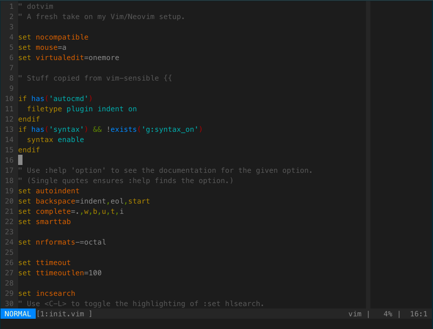

dotvim
======

A relatively barebones Vim setup.

# Features

  * **Clean**. Nothing (well, almost nothing) is in this setup that I don't use
    regularly.
  * **Reproducible**. You don't need to worry (much. TODO: don't reference
    personal/ directory) about where you put these files - just that you
    properly use `init.vim` as your vimrc file. We figure out the rest.
    * You could even have multiple copies laying around! All plugins get
      installed into a subdirectory of this repo.

# How do I get started?

  * Clone this repository (TODO: Pull into its own repo)
  * Either link `init.vim` as your `.vimrc`
    (`ln -sf $PWD/dotvim/init.vim ~/.vimrc`), or try it out with
    `vim -u dotvim/init.vim`
  * That's it!
    * You _may_ need to run `:PlugInstall`. This should happen automatically
      though.

# What does it look like?

